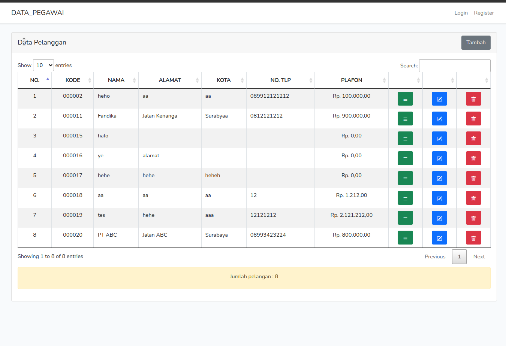

Aplikasi berikut dibuat menggunakan framework laravel 9.
Berisi tentang contoh studi kasus CRUD Data Pelanggan

Terdapat sebuah trigger untuk melakukan insert kode pegawai, yaitu :
delimiter //
CREATE TRIGGER generate_kode_pelanggan BEFORE INSERT
ON pelanggans
FOR EACH ROW
IF ((SELECT MAX(kode_pelanggan) FROM pelanggans) IS NULL) THEN
SET NEW.kode_pelanggan='000001';
ELSE
SET NEW.kode_pelanggan=(SELECT LPAD((SELECT MAX(kode_pelanggan) FROM pelanggans)+1, 6, 0));
END IF; //
delimiter ;

Untuk instalasi lakukan : 
- composer install
- php artisan key:generate
- php artisan migrate

Screenshoot Aplikasi :

